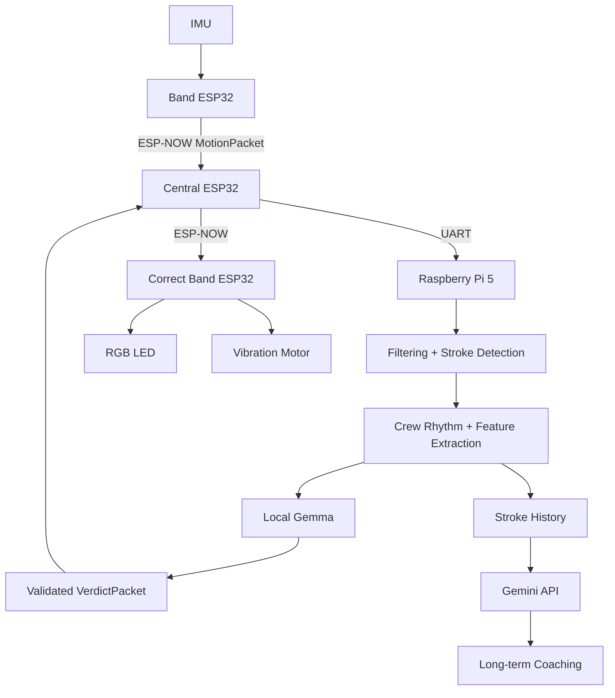

# CrewSync System Flow

```mermaid
flowchart TD
    A[IMU] --> B[Band ESP32]
    B -->|ESP-NOW MotionPacket| C[Central ESP32]
    C -->|UART| D[Raspberry Pi 5]
    D --> E[Filtering + Stroke Detection]
    E --> F[Crew Rhythm + Feature Extraction]
    F --> G[Local Gemma]
    G --> H[Validated VerdictPacket]
    H --> C
    C -->|ESP-NOW| I[Correct Band ESP32]
    I --> J[RGB LED]
    I --> K[Vibration Motor]
    F --> L[Stroke History]
    L --> M[Gemini API]
    M --> N[Long-term Coaching]
```

Physical loop:
Movement -> IMU -> ESP32 -> ESP-NOW -> Central -> Pi -> features -> Gemma -> verdict -> Central -> ESP-NOW -> correct band -> LED/haptic.
